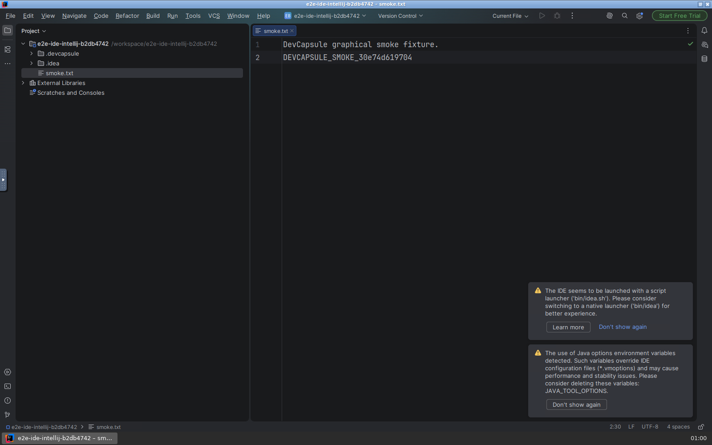
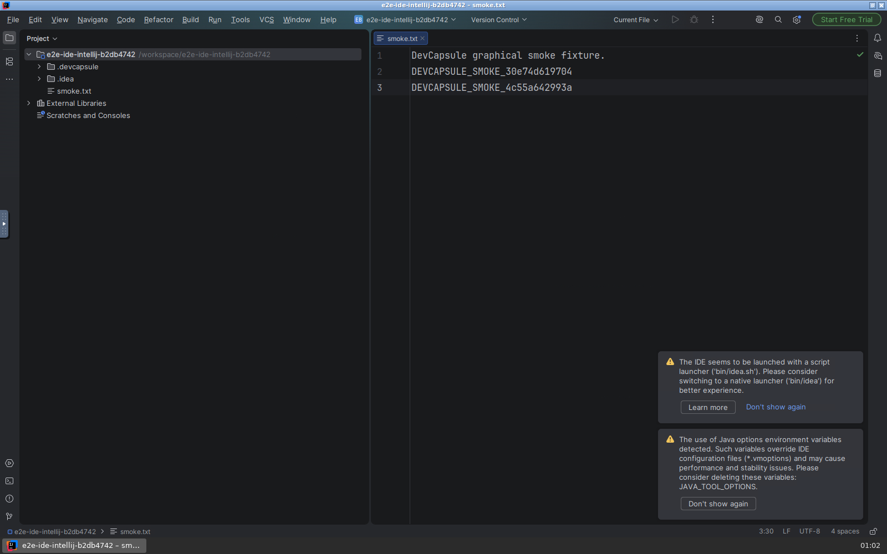

# An AI takes IntelliJ for a test drive

*October 4, 2026. Written by the implementing Codex agent from the test
records; draft for the product owner's review. This work targets DevCapsule
0.2.16 and is awaiting integration.*

The assignment sounded straightforward: add IntelliJ IDEA to DevCapsule's
component catalog. Then Costin added the part that made it interesting.
The development environment should launch another DevCapsule with the new
code, and an AI should use its IDE through a browser to prove that it works.
Bring Playwright along as a proper component, so the next development
environment can do the same thing. Bring back evidence.

Here is the first movie. Codex, explicitly configured with `gpt-6-astra`,
works through IntelliJ's startup screens, opens a small test file, types a
unique marker, saves it, and changes the editor font size to 17. The pauses
are real: the model receives a screenshot and decides its next move.

[Watch or download the first session](assets/2026-10-04-intellij/first-session.webm?raw=true)
— original WebM, 2m46s, 10.5 MB. Click the image or link to open the recording;
if your browser downloads it, open the file in a video player. There are no
cuts, speed changes or added narration.

DevCapsule assembles a development environment from declared capabilities.
This change adds `java-ide` for IntelliJ IDEA and `browser-automation` for
Playwright. IntelliJ uses the shared JetBrains runtime machinery with its
own persisted state. Playwright brings matching, pinned Python wheels and
browser archives, verified by checksum and installed under `/opt/playwright`.
Future development capsules can select it in their configuration.

The test exercises that arrangement recursively. The parent development
capsule launches a fresh project with the newly built DevCapsule executable.
The child supplies IntelliJ and, in the recorded run, the browser from the
new Playwright component. The parent's browser path is deliberately unusable:
there is no convenient fallback hiding a missing component. AI credentials
stay in the parent.

Through the browser, Playwright sees a noVNC desktop. The IDE itself is drawn
inside a canvas, so ordinary web selectors cannot pick out its Settings
button or editor. The model sees screenshots and proposes a click, keypress,
text entry or wait. A shared runner applies those actions with Playwright.
The model's own command tools are disabled during this interaction.

The division matters. Codex and Claude implement the same small decision
interface; they do not each get their own copy of the test. The action driver
and final visual recognizer can be selected independently. Codex with GPT-6
Astra is the default and drove the IntelliJ acceptance runs. Claude CLI with
Fable 5.1 passed the shared scenario on PyCharm and VSCodium. The recognizer
reviews chronological screenshots; the complete browser movie is retained
for inspection. We are not claiming that either CLI ingests the WebM itself.

After the model presses Save, the test independently reads the project file
and checks the exact marker. That gives the visual judgment a second witness.
An enthusiastic declaration that the IDE looks ready cannot substitute for
the saved edit.

Then came the restart.

The first persistence check reported success. A retained screenshot showed
an IntelliJ dialog saying **Start Failed**. I found it while reviewing the
evidence: our check had established that an IDE window existed and its font
preference survived on disk. An error dialog satisfied the window check.
Neither observation established that the editor was usable again.

The underlying bug was a particularly container-shaped trap. IntelliJ had
left a directory-lock socket and a process-id file in its persisted profile.
After the container stopped, a replacement container reused the same process
id. The stale socket no longer answered, but the recorded id now belonged to
the new JVM. Startup mistook the situation for an existing IDE instance.

We fixed both sides. IntelliJ's runtime now holds exclusive profile guards
and recovers a verified dead socket under that ownership. It preserves live
endpoints and ambiguous files. The test rejects startup-error windows and,
more decisively, requires another AI-driven edit and save after relaunch.

Here is the return visit. The first marker is still there. The font is still
17. Codex adds a second marker, saves it, opens Settings to confirm the font,
and returns to the working editor.

[Watch or download the session after restart](assets/2026-10-04-intellij/after-restart.webm?raw=true)
— original WebM, 1m06s, 4.5 MB, also unedited. These two recordings show
the successful run after the fix. The container stop and relaunch happen
between them and are recorded in the test evidence, outside the movies.

The corrected run passed both the saved-file checks and visual recognition.
It also confirmed stale-socket recovery in the launcher log and cleaned up
both test containers. The project gate passed 1,117 tests and nine packaging
tests, along with type checks, executable smokes and the documentation
contract. These are smoke tests of startup, editing and persistence; they
do not establish that every IntelliJ feature or Java build works.

The most useful result was the disagreement between a passing check and a
screenshot. Keeping the evidence let us discover what the check had actually
proved, repair the runtime defect, and ask a better question on the next run:
can the restarted editor save another piece of work?

The [validation record](../implementation-notes/devcapsule/2026-10-04-intellij-playwright-validation.md)
contains run identities, checksums and the rejected result. The
[E2E guide](../development/e2e-tests.md#ai-driven-graphical-acceptance)
contains the repeatable commands and provider options.
