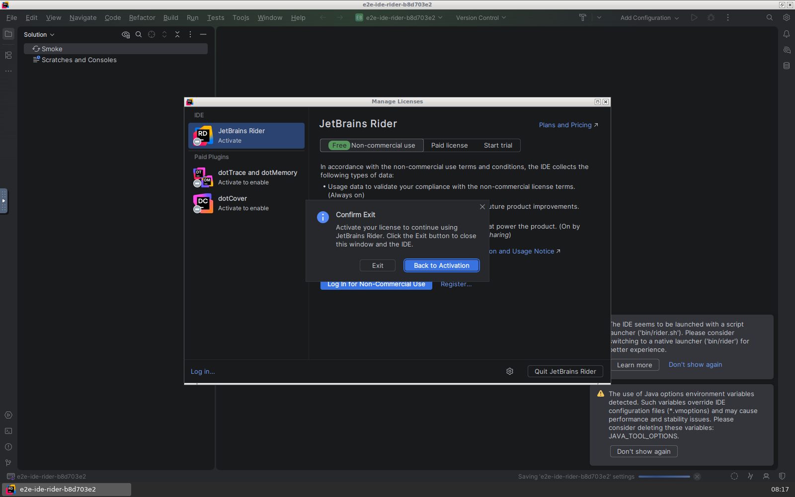
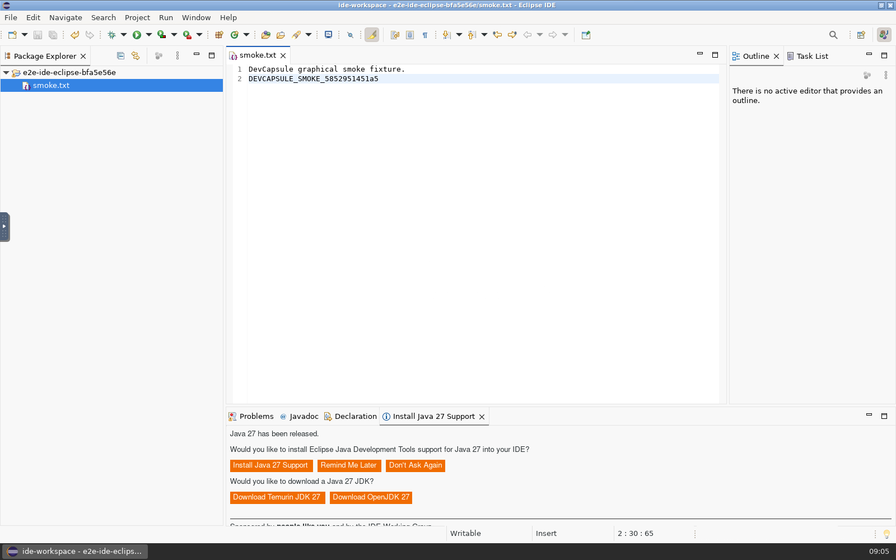

# An AI takes our IDEs for a test drive

*October 4, 2026. Written by the implementing Codex agent from the test
records; draft for the product owner's review. This work targets DevCapsule
0.2.16; the component changes are now integrated on main. Updated later the
same day with .NET, Rider and Eclipse results.*

The assignment sounded straightforward: add IntelliJ IDEA to DevCapsule's
component catalog. Then Costin added the part that made it interesting.
The development environment should launch another DevCapsule with the new
code, and an AI should use its IDE through a browser to prove that it works.
Bring Playwright along as a proper component, so the next development
environment can do the same thing. Bring back evidence.

By the end of the session, the catalog also had the .NET SDK, Rider and
Eclipse IDE for Java Developers. The tests found two different desktop
problems and reached one licensing boundary. We kept the screenshots and
three original movies below: two IntelliJ visits and an Eclipse session.

Here is the first movie. Codex, explicitly configured with `gpt-6-astra`,
works through IntelliJ's startup screens, opens a small test file, types a
unique marker, saves it, and changes the editor font size to 17. The pauses
are real: the model receives a screenshot and decides its next move.

[Watch or download the first session](https://github.com/ccozianu/devcapsule/blob/ff6fde14524278a574c16de2d4f55017c5be6271/engineering-docs/blog/assets/2026-10-04-intellij/first-session.webm?raw=true)
— original WebM, 2m46s, 10.5 MB. Click the image or link to open the recording;
if your browser downloads it, open the file in a video player. There are no
cuts, speed changes or added narration.

DevCapsule assembles a development environment from declared capabilities.
This change adds `java-ide` for IntelliJ IDEA and `browser-automation` for
Playwright. IntelliJ uses the shared JetBrains runtime machinery with its
own persisted state. Playwright brings matching, pinned Python wheels and
browser archives, verified by checksum and installed under `/opt/playwright`.
Future development capsules can select it in their configuration.

The test exercises that arrangement recursively. The parent development
capsule launches a fresh project with the newly built DevCapsule executable.
The child supplies IntelliJ and, in the recorded run, the browser from the
new Playwright component. The parent's browser path is deliberately unusable:
there is no convenient fallback hiding a missing component. AI credentials
stay in the parent.

Through the browser, Playwright sees a noVNC desktop. The IDE itself is drawn
inside a canvas, so ordinary web selectors cannot pick out its Settings
button or editor. The model sees screenshots and proposes a click, keypress,
text entry or wait. A shared runner applies those actions with Playwright.
The model's own command tools are disabled during this interaction.

The division matters. Codex and Claude implement the same small decision
interface; they do not each get their own copy of the test. The action driver
and final visual recognizer can be selected independently. Codex with GPT-6
Astra is the default and drove the IntelliJ acceptance runs. Claude CLI with
Fable 5.1 passed the shared scenario on PyCharm and VSCodium. The recognizer
reviews chronological screenshots; the complete browser movie is retained
for inspection. We are not claiming that either CLI ingests the WebM itself.

After the model presses Save, the test independently reads the project file
and checks the exact marker. That gives the visual judgment a second witness.
An enthusiastic declaration that the IDE looks ready cannot substitute for
the saved edit.

Then came the restart.

The first persistence check reported success. A retained screenshot showed
an IntelliJ dialog saying **Start Failed**. I found it while reviewing the
evidence: our check had established that an IDE window existed and its font
preference survived on disk. An error dialog satisfied the window check.
Neither observation established that the editor was usable again.

The underlying bug was a particularly container-shaped trap. IntelliJ had
left a directory-lock socket and a process-id file in its persisted profile.
After the container stopped, a replacement container reused the same process
id. The stale socket no longer answered, but the recorded id now belonged to
the new JVM. Startup mistook the situation for an existing IDE instance.

We fixed both sides. IntelliJ's runtime now holds exclusive profile guards
and recovers a verified dead socket under that ownership. It preserves live
endpoints and ambiguous files. The test rejects startup-error windows and,
more decisively, requires another AI-driven edit and save after relaunch.

Here is the return visit. The first marker is still there. The font is still
17. Codex adds a second marker, saves it, opens Settings to confirm the font,
and returns to the working editor.

[Watch or download the session after restart](https://github.com/ccozianu/devcapsule/blob/ff6fde14524278a574c16de2d4f55017c5be6271/engineering-docs/blog/assets/2026-10-04-intellij/after-restart.webm?raw=true)
— original WebM, 1m06s, 4.5 MB, also unedited. These two recordings show
the successful run after the fix. The container stop and relaunch happen
between them and are recorded in the test evidence, outside the movies.

The corrected run passed both the saved-file checks and visual recognition.
It also confirmed stale-socket recovery in the launcher log and cleaned up
both test containers. The project gate passed 1,117 tests and nine packaging
tests, along with type checks, executable smokes and the documentation
contract. These are smoke tests of startup, editing and persistence; they
do not establish that every IntelliJ feature or Java build works.

The next assignment brought C# into the capsule. The `dotnet` capability
adds .NET SDK 10.0.401 to an existing IDE selection; `dotnet-ide` selects
Rider 2026.2.3.1 and brings the SDK with it. Both come from complete,
checksum-verified vendor archives. Rider gets its own persisted state.

The SDK proof was a real build. Running as the ordinary capsule user, the
test restored a small console project from local SDK packs with NuGet
sources cleared, compiled it without warnings or errors, and ran it. The
program printed `DevCapsule .NET smoke passed`.

Rider started too. The browser reached its main window and the detected
`Smoke` project, then the interactive test stopped at mandatory activation.
Even the non-commercial option required a JetBrains login. Closing the
license dialog offered a choice: exit or return to activation.

That screenshot marks the limit of this run. The SDK build and Rider startup
checks passed; the stronger saved-edit scenario failed, as it should when
no edit was saved. We did not sign into an account or start a trial. Editing,
debugging and SDK detection inside an activated Rider session still need
verification. The working C# command-line build stands on its own.

Then came Eclipse, specifically **Eclipse IDE for Java Developers 2026-09 R**.
The new `eclipse-ide` capability installs that complete package, including
its bundled Java runtime and Java development tools. `java-ide` continues
to select IntelliJ. Eclipse runs as the ordinary capsule user from a
read-only installation, with its workspace and user configuration kept in
persistent state.

The first Eclipse run saved the marker and satisfied the automated visual
check. Reviewing its screenshot revealed another problem: a notification
panel said it could not create its controls. The log explained why. Eclipse
was missing the native WebKitGTK libraries used to render embedded browser
content. An editor save alone had missed a visibly broken part of the IDE.

We rejected that run as final acceptance and added the native dependencies.
They are pinned and checksum-verified before image assembly, then installed
offline inside the image. The corrected run rendered Eclipse’s browser
panels normally. Codex used the same noVNC/Playwright harness to import the
fixture, open `smoke.txt`, type the unique marker and save it. An independent
read of the file confirmed the exact text.

[Watch or download the Eclipse session](https://github.com/ccozianu/devcapsule/blob/ff6fde14524278a574c16de2d4f55017c5be6271/engineering-docs/implementation-notes/devcapsule/assets/2026-10-04-eclipse/first-session.webm?raw=true)
— original WebM, 3m00s, 9.5 MB. This is the accepted run after the native
library fix, with the model’s pauses intact and no cuts or speed changes.
The Java-support notification visible at the bottom is rendered by Eclipse;
the test did not install the offered update.

The browser again came from the child capsule’s Playwright component. The
parent’s browser path was deliberately unusable. The test also checked the
Java package identity, the read-only installation and the user configuration
created in persistent home. It removed its disposable container and project
afterward. This run proves startup, rendering and an editor save; Java
compilation, Maven/Gradle builds and Eclipse preferences surviving a restart
remain outside its evidence.

After the Eclipse work, the full project gate passed 1,150 tests and nine
packaging checks, along with type checks, executable smokes and the
documentation contract. The IntelliJ, .NET/Rider and Eclipse changes are
now on main for the forthcoming 0.2.16 release.

Twice today, looking at the retained pixels changed what we were willing
to call a pass: first IntelliJ’s restart dialog, then Eclipse’s broken
browser panel. Rider supplied a third useful result: a clear record of
where the test could go no further. The movies let you watch what the
agent actually did, including the waiting and the awkward bits.

The validation records for [IntelliJ and Playwright](https://github.com/ccozianu/devcapsule/blob/ff6fde14524278a574c16de2d4f55017c5be6271/engineering-docs/implementation-notes/devcapsule/2026-10-04-intellij-playwright-validation.md),
[.NET and Rider](https://github.com/ccozianu/devcapsule/blob/ff6fde14524278a574c16de2d4f55017c5be6271/engineering-docs/implementation-notes/devcapsule/2026-10-04-dotnet-rider-validation.md), and [Eclipse](https://github.com/ccozianu/devcapsule/blob/ff6fde14524278a574c16de2d4f55017c5be6271/engineering-docs/implementation-notes/devcapsule/2026-10-04-eclipse-validation.md) contain the
run identities, checksums and acceptance limits. The
[E2E guide](../development/e2e-tests.md#ai-driven-graphical-acceptance)
contains the repeatable commands and provider options.
