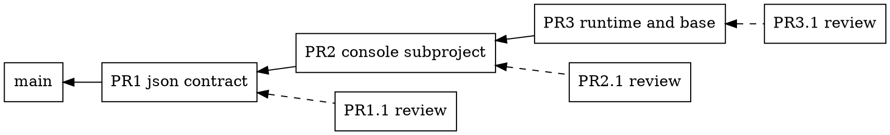

# Workstream Current Status: Capsule Web Console

Mnemonic: `capsule-webconsole`

Start date: 2026-10-09

State: active; slice 1 of the first iteration, the JSON contract, implemented on this branch and gated; the owner directs the work from the work order under the 2026-10-09 orchestration exception

Definition read: WORKFLOW.md@9593256c1f36, WORKFLOW-LOCAL.md@94e091bf2579

Branch association: `ws-capsule-webconsole/first-slice`

Integration target: `main`

Delivery method: pull request, merge commit

Requirements: `R-CONSOLE-001`

Work order: [the capsule web console](../../work-orders/2026-10-09-capsule-webconsole.md), issued 2026-10-09 by `project-management`; its DOT and materialized-views amendments are in intake, and the amended text is on `project-management`'s branch until its next integration

## Goal And Scope

Every capsule serves a web console on a token-gated loopback port, whenever
the runtime runs, with or without a display. The console shows what the
`devcapsule` commands report, as HTML: the configuration, the versions, the
project information, and live process and resource data from inside the
capsule. Later slices render the repository's records and workflow state and
host the decision pages the workflow's human-input rules allow.

Owner decisions of 2026-10-09 that shape the work:

1. The console lives in the base image for every adopter. It is not a
   component and not a selectable capability. A headless user reaches it
   with an SSH port forward.
2. Architecture: a static web structure plus a FastAPI application for
   dynamic data. The console is a separate process, not part of the runtime
   PEX. It reads the mounted project and calls the runtime CLI's `--json`
   outputs as its API.
3. No existing open-source console is adopted as the framework. Glances or a
   similar tool may become an optional component later, linked from the
   console, but the configuration, records and workflow pages are ours and
   no product renders them.

## Current State

**2026-10-09, slice 1: the JSON contract.** `config list --json` and
`versions show --json` exist, with schema version 1, on the host and inside a
capsule. The text reports render from the same documents, so the two cannot
disagree. The work order's three mail items are accepted as the goal and
dispositioned. R-CONSOLE-001 is accepted, as the work order asked for the
first integration. The user documentation names the flags. The build gate
ran on this branch before the checkpoint; see *Validation And External State*.

Judgments recorded for this slice:

- Inside a capsule, `config list --json` carries the mounted checkout record
  and the launcher command, not the table's rows. The text report does the
  same. The rows are computed against the host: a binding row checks a host
  directory and a secret row checks the launching shell's environment, and
  neither is observable from the capsule. A row computed here would state
  something false about the host. The console's configuration page renders
  the record in a capsule and the rows on a host.
- The JSON shape rule, written beside the schema constants: adding a key
  keeps the version; renaming, removing or retyping one bumps it.
- One help text for every stable `--json` flag, shared from the command
  framework, names the console as the reader.
- `versions show` gained `--json`; `check`, `history` and the rest did not.
  The work order leaves further flags to the page that needs them.

### How the work runs

The owner's instructions of 2026-10-09, given at the switch, are an exception
to the human-input rule for this iteration. The agent implements the work
order's first iteration, deliverables 1 and 2, without stopping for
decisions. Stopping points become written proposals in the pull request.
Two limits stay: no write operation beyond deliverable 5's answer file, and
no reach beyond the loopback port and the run token. The owner merges to
`main`; the agent never does.

The slices are stacked pull requests, each reviewed by a second agent pair
before the next one starts:

- PR1, this branch: `--json` on `config list` and `versions show`.
- PR2, on PR1's branch: the `devcapsule-webconsole/` subproject with the
  token gate, path confinement, and the home, configuration, versions and
  project pages.
- PR3, on PR2's branch: the runtime child, port and token wiring, base
  recipe 10, the development mount, the fresh-capsule smoke and the IDE
  smoke column.
- Each PRn.1 is written by the Codex and gpt-6-astra pair from a
  `-review` branch off PRn's branch, aimed at clarity, correctness and test
  coverage of PRn's lines. This workstream reviews it in PR comments and
  merges it into PRn's branch, or pushes back, at most three rounds, then
  waits for the owner. PRn+1 starts only after PRn.1 is settled.

## Planned Next Step

1. Open PR1 against `main` and request PR1.1 from the Codex pair.
2. Settle PR1.1. Then branch PR2 from this branch.
3. PR2: the console subproject, runnable on a host against the installed
   CLI, with its unit tests.
4. PR3: deliverable 1's runtime and base work, with the smokes. Propose the
   base-release trigger in that pull request.

Later iterations: deliverables 3 and 4 in the order this workstream chooses,
then 5, then 6.

## Validation And External State

- Slice 1 unit modules: 468 passed with `PYTEST_ADDOPTS` scratch under
  `/opt/devcapsule-gate/pytest`; `/tmp` overflowed at 2 GB first.
- `mypy devcapsule`: no issues in 112 files.
- Build gate `nox -s build` on this branch, 2026-10-09: 1,262 unit cases, 10
  packaged integrations, type check, source and PEX smokes, documentation
  contract; successful.
- No containers, images or ports in use.

## Open Threads

- Base-release cadence: a console change reaches adopters only with a base
  image rebuild and publication, which the release runbook treats as rare.
  A trigger for the release policy is proposed with PR3.
- Dependencies in the base: Ubuntu's `python3-fastapi` and friends are old;
  a hash-pinned venv at image build is the plan, like Playwright's.
- The work order on `main` lacks deliverable 6; the amended text is on
  `project-management`'s branch. The mail item carries its substance.
- Deliberately not preserved: the exploration of adopting Glances, Netdata,
  Cockpit or a Docker dashboard as the framework; the reasons are summarized
  in decision 3 above.

## Workstream Document Index

- [Intake decisions](intake-dispositions.md) and [intake](intake/README.md) — coordination
