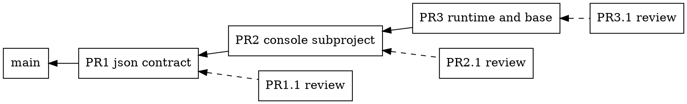

# Workstream Current Status: Capsule Web Console

Mnemonic: `capsule-webconsole`

Start date: 2026-10-09

State: active; PR5 (#192) and PR6 (#194) await the owner with their Codex reviews merged; PR7, decision pages (deliverable 5), is implemented on `ws-capsule-webconsole/decisions` and gated

Definition read: WORKFLOW.md@9593256c1f36, WORKFLOW-LOCAL.md@7362bae8ec82

Branch association: `ws-capsule-webconsole/live-resources` (PR5, #192, from `main`); `ws-capsule-webconsole/records` (PR6, #194, stacked on PR5); `ws-capsule-webconsole/decisions` (PR7, stacked on PR6); the first iteration's branches `first-slice`, `console-app`, `runtime-base` and `project-info-checkout-name` are merged and closed

Integration target: `main`

Delivery method: pull request, merge commit

Requirements: `R-CONSOLE-001`

Work order: [the capsule web console](../../work-orders/2026-10-09-capsule-webconsole.md), issued 2026-10-09 by `project-management`; its DOT and materialized-views amendments are in intake, and the amended text is on `project-management`'s branch until its next integration

## Goal And Scope

Every capsule serves a web console on a token-gated loopback port, whenever
the runtime runs, with or without a display. The console shows what the
`devcapsule` commands report, as HTML: the configuration, the versions, the
project information, and live process and resource data from inside the
capsule. Later slices render the repository's records and workflow state and
host the decision pages the workflow's human-input rules allow.

Owner decisions of 2026-10-09 that shape the work:

1. The console lives in the base image for every adopter. It is not a
   component and not a selectable capability. A headless user reaches it
   with an SSH port forward.
2. Architecture: a static web structure plus a FastAPI application for
   dynamic data. The console is a separate process, not part of the runtime
   PEX. It reads the mounted project and calls the runtime CLI's `--json`
   outputs as its API.
3. No existing open-source console is adopted as the framework. Glances or a
   similar tool may become an optional component later, linked from the
   console, but the configuration, records and workflow pages are ours and
   no product renders them.

## Current State

**2026-10-09, slice 7: decision pages (deliverable 5).** The contract is
`devcapsule-webconsole/DECISIONS.md`: an agent writes `<id>.json` into the
capsule's decisions directory, `$XDG_STATE_HOME/devcapsule/decisions` by
default; the console lists and renders it, the human chooses, the console
writes `<id>.answer.json` beside it, and the agent reads the answer,
records the outcome in the normal files and deletes both. A decision has
a title, who asks, a markdown context, and items, each with a summary,
records cited as paths, two or more options, and single or multiple
choice. `python -m devcapsule_webconsole.decisions from-table` builds a
decision from a markdown table, so any agent can produce one; `check`
validates a document and its answer. The answer route is the console's one
write: same-origin only, on top of the `SameSite=Strict` cookie, and a
refusal writes nothing. Run by hand with two intake items as a sample: the
page rendered, a browser answered it, the answer file holds the choices;
see [evidence/2026-10-09-decision-sample](evidence/2026-10-09-decision-sample/).

Judgments recorded for slice 7:

- The answer lands under XDG state inside the capsule, never in the
  project. The first use is project-management's intake pass, and nothing
  the console writes may become a record by accident.
- The console never deletes a decision or an answer: discarding is the
  agent's step after it has recorded the outcome, so the human can submit
  again until then and the latest answer stands.
- The contract is one JSON object with a table-shaped item list, and the
  table builder is part of the package, which is the "small enough to
  produce from a markdown table" test of the work order.
- Markdown in a decision renders with the same settings as a record: no
  raw HTML, no active links from the content.

**2026-10-09, slice 6: records and DOT (deliverable 4).** Any markdown file
in the project renders in the browser: `index.md` is the front page, a
record's relative links are rewritten to stay inside the console, a fenced
`dot` block renders as a Graphviz diagram, and images and other linked
files are served raw through a new bytes route confined like the text one.
The renderers are vendored browser builds, `markdown-it` 15.0.2 (the
website's) and `viz.js` 3.31.0, with their provenance and digests in
`VENDORED.md` and a test that checks the digests. Run by hand against this
checkout: the index renders with its 283 links rewritten, and this status
file renders with its DOT stack diagram drawn.

**PR #194 is open against PR5's branch. Its review, PR #195 by the Codex
and gpt-6-astra pair, was merged without a round.** Six findings, all
accepted: the wheel omitted the vendored renderers, so a capsule's
installed console would have had none, now packaged and tested; raw
responses carry a sandbox policy and `nosniff`, so an opened SVG cannot
use the console's origin; Graphviz output is shown as an image, so a DOT
`URL` attribute cannot become an active link; record links are decoded
once, query-only links and raw fragments are kept, invalid targets become
inert; headings have fragment targets; and more coverage of the raw route
and the bytes reader. Re-checked in a browser on the merged branch: the
diagram renders as an image, headings carry ids, raw responses carry the
headers.

Judgments recorded for slice 6:

- Raw HTML inside a record is not rendered (`html: false`): a record is the
  project's own text, but the console's origin carries the run token in a
  cookie, and no project file may run as a page in that origin. For the same
  reason the raw route serves HTML and scripts as plain text.
- A link to a `.md` file goes to the records page; any other relative link
  goes to the raw route; absolute URLs, root paths and fragments are left as
  written. A link that climbs above the project is left as written too, and
  the server refuses it.
- The page is one static file for every record path; the script reads the
  path from the URL. No server-side rendering, no template engine.
- DOT only, as the owner decided; a block in any other diagram notation is
  shown as code.

**2026-10-09, slice 5: live processes and resources (deliverable 3).** The
owner merged #184 and #190, so the first iteration is on `main`, and
directed the second iteration, deliverables 3, 4 and 5. This slice adds a
monitor module to the console: psutil for the processes, each with its CPU
share over a short interval and its resident memory; the cgroup v2 root for
the capsule's CPU time against its quota or the host's CPUs, its memory
charge against its limit, and its process count. Two `GET` routes serve the
readings and a Processes page refreshes them every three seconds, with a
pause. psutil joins the console's hash-pinned set, so base recipe 11
rebuilds the console venv; an older base runs the previous console. Run by
hand against this capsule: the page renders the real readings.

**PR #192 is open against `main`. Its review, PR #193 by the Codex and
gpt-6-astra pair, was merged without a round.** Eight findings, all
accepted: psutil's cached process objects shared CPU baselines between
concurrent requests, now per-request CPU-time deltas with an identity
check; a reused pid could stand for another process; the host's cgroup
root could pass as the capsule's; reset counters gave negative rates;
denied processes vanished instead of showing null CPU; the page's pause
raced its refresh; the pid meter counts tasks, now labelled so; and a
recipe 10 base now runs its installed console instead of mounted slice-5
source it cannot import, with a probe that says why.

Judgments recorded for slice 5:

- CPU use is a rate over a quarter second, measured on the server at each
  request, against the CPUs the capsule may use: its quota when it has one,
  the host's count otherwise. Memory is the cgroup's current charge against
  `memory.max`, unlimited shown as such.
- Outside a cgroup v2 root the resource reading says it is unavailable,
  with every figure null; the process list still works. A host-run console
  therefore shows processes and no meters, and says why.
- The process list omits a process that ends during the sample and shows
  one it may not fully read without the fields it could not read.
- The dependency change bumps the base recipe to 11: the self-hosting
  source mount cannot add a dependency to the image's venv, so a capsule
  with the recipe 10 base runs the console without the monitor's module.

**2026-10-09, evening: integration state.** The owner merged #184 to
`main`, then #186 into `ws-capsule-webconsole/first-slice` and #188 into
`ws-capsule-webconsole/console-app`, after those branches had been merged
below them. `main` therefore carries slice 1 only; the two merges put
nothing new on `main`. PR4's branch descends from all three slices; `main`
was merged into it and #190 was retargeted to `main`, so it carries slices
2, 3 and 4 together. The owner merges it.

**2026-10-09, slice 4: `project info` names the checkout from its record's
location.** The owner moved the defect found in slice 2 from `maintenance`
to this workstream. One helper, `checkout_name_for`, derives the name from
where the record lives, and `config list`, `project info`, the launch
context and the checkout registry all use it. The text report of
`project info` gains a `Checkout name:` line. Inside a capsule the name
comes from the mounted record, so a context captured by an older launcher
reports it right without a relaunch. Verified against this capsule's real
records: `project info` and `config list` now both say `devcapsule-2nd-home`.
The console's home page shows the right name with no change of its own.

**PR #190 is open against PR3's branch. Its review, PR #191 by the Codex
and gpt-6-astra pair, was merged without a round.** No behavior change:
the captured name is computed once, the helper and the runtime property
state the name's provenance precisely, and coverage gained the captured
fields before the runtime override, older contexts with and without
captured information or the recorded name, the registry with an explicit
environment, and the registered default checkout's name. The gate on the
merged branch is recorded below.

Judgments recorded for slice 4:

- `configured_information` takes the name as a required argument instead of
  reading a key no writer puts in the record. The callers know the record's
  location; the information module does not.
- An unregistered checkout is named `default`, the name its first `config
  list` would give the record it materializes.
- The runtime report overrides the captured name rather than trusting it,
  because every context captured before this fix says `default`.

**2026-10-09, slice 3: the console runs and is reached.** The runtime plan
gained a `console` section, like the display's: a listen address, a port
and the token path, plus an optional `source_path` for the self-hosting
exception. The launcher allocates a host loopback port and a per-run token
whenever a runtime plan is launched, with or without a display, mounts the
token read-only, publishes the port off host networking, prints the console
URL, and watches readiness. The entrypoint starts the console as a supervised
child beside the display's children, or alone in a headless job. Base recipe
10 installs the console under `/opt/devcapsule-webconsole`: a venv built at
image build from the subproject's hash-pinned files, the package itself from
the same public revision as the runtime, fetched with git so the commit hash
verifies the content. The smoke of deliverable 1 is an end-to-end test with
and without a display, and the IDE smoke rows gained "console answers". A
user page documents the console link, the token and the SSH forward.

**PR #188 is open against PR2's branch. Its review, PR #189 by the Codex
and gpt-6-astra pair, was merged without a round.** Seven findings, all
accepted: two released sockets could hand the console the display's port,
now retried; the readiness probe for an IPv6 wildcard listener used IPv4;
the base installer expanded the source identity as shell code, now quoted
and executed with stubs in seven integration cases; an unknown source
identity reached the base builder, now refused before the build with a
message naming the published-source PEX; the opener test could pass
without opening, replaced by a deterministic one; coverage of token-file
failures, cleanup and contract edges; and two corrections to the user page.
The gate on the merged branch and the smoke rerun are recorded below.

Judgments recorded for slice 3:

- One page opens by itself. With a contained display the desktop opens and
  the console is announced as ready, not opened; two tabs for one run would
  be noise. Without a desktop the console opens, so a headless or
  passthrough run still lands the developer on one page. The owner can
  flip this.
- The console runs whenever a runtime plan is launched. There is no option
  to turn it off, because the work order makes it part of every capsule;
  an older base without the console is announced and skipped, not refused,
  since the runtime is launcher-supplied and runs on any base with the
  display label.
- The self-hosting exception is mechanical: when the launched project
  carries `devcapsule-webconsole/devcapsule_webconsole/`, the console child
  runs that source ahead of the image's copy through `PYTHONPATH`, with the
  image's interpreter and dependencies, and says so. No separate mount: the
  project is already mounted. Any other project runs the base's console.
- The base fetches the console's source with `git fetch` by commit, which
  verifies the content against the hash; an archive download would not.
  The build toolchain is hash-pinned too, in `requirements-build.txt`, so
  the venv install fetches nothing unpinned.
- The console's readiness timeout is 60 s, three times the display's:
  FastAPI's import on a cold host is slower than an X server's start.

**2026-10-09, slice 2: the console subproject.** `devcapsule-webconsole/`
is a second distribution: a FastAPI application, a static tree and tests,
with hash-pinned runtime and development requirement sets. It serves the
home, configuration, versions and project pages from the runtime CLI's
`--json` documents, read by running the CLI. Every request carries the run
token or is refused, static files included; the token arrives in the printed
URL and is kept in a cookie. File reads resolve inside the project mount
only. Every route is `GET`. A new nox session, `webconsole`, type-checks and
tests it in its own environment, and the build gate queues that session.
Run by hand against this capsule's real CLI, all four pages render; the
screenshots are under [evidence/2026-10-09-console-pages](evidence/2026-10-09-console-pages/).

**PR #186 is open against PR1's branch. Its review, PR #187 by the Codex
and gpt-6-astra pair, was merged without a round.** Seven findings, all
accepted: a time-of-check race on the project-file route, closed with
descriptor-anchored `O_NOFOLLOW` reads; a malformed cookie header crashing
the gate; a non-object or non-finite JSON document passing through the
reader; token characters an unquoted cookie cannot carry; the nox session
picking the runtime's mypy configuration instead of the console's strict
one; tighter types; and 37 added tests, 89 in all. The gate on the merged
branch is recorded below.

Judgments recorded for slice 2:

- The console does not import the runtime. Its API is a subprocess call
  per document, uncached, so a change made with a command is on the page at
  the next reload, as deliverable 2 asks.
- The token is carried three ways: the query parameter from the printed URL,
  the cookie the console sets in answer to it, and a header for scripts. A
  valid query token sets the cookie `HttpOnly; SameSite=Strict`. Comparison
  is constant-time.
- Path confinement refuses any `..` component, an absolute path, a NUL, and
  a symbolic link that resolves outside the mount. The project-file route is
  the foundation of deliverable 4; in this slice it serves UTF-8 text only.
- The console takes the CLI executable as an explicit argument. The shipped
  PEX has a fixed path, but the command name is `devcapsule0` in a
  self-hosting capsule, so guessing from PATH would be wrong there.
- The subproject has its own environment and nox session, never the
  runtime's: FastAPI's dependency set would otherwise be pinned twice.
- Pages are static HTML with one script that builds the DOM from the
  documents with `textContent` only. No template engine, no build step.
- The identity block on the home page composes `project info` and
  `versions show`; see the open thread on the checkout name.

**2026-10-09, slice 1: the JSON contract.** `config list --json` and
`versions show --json` exist, with schema version 1, on the host and inside a
capsule. The text reports render from the same documents, so the two cannot
disagree. The work order's three mail items are accepted as the goal and
dispositioned. R-CONSOLE-001 is accepted, as the work order asked for the
first integration. The user documentation names the flags. The build gate
ran on this branch before the checkpoint; see *Validation And External State*.

**PR #184 is open against `main`. Its review, PR #185 by the Codex and
gpt-6-astra pair, was merged into the branch after one round.** The review
found one regression #184 had introduced: the next-launch identity was
computed outside the error boundary, so a malformed local selection hid the
running session. It also found a pre-existing confusion of a named checkout
called `devcapsule` with the default checkout, now fixed on both sides of
the mount with a `checkout-name` field in the launch context. The one
round asked for validation of that optional field beside its neighbours;
the pair delivered it with five rejection cases. The pair's gate and this
workstream's gate on the merged branch are recorded below.

Judgments recorded for this slice:

- Inside a capsule, `config list --json` carries the mounted checkout record
  and the launcher command, not the table's rows. The text report does the
  same. The rows are computed against the host: a binding row checks a host
  directory and a secret row checks the launching shell's environment, and
  neither is observable from the capsule. A row computed here would state
  something false about the host. The console's configuration page renders
  the record in a capsule and the rows on a host.
- The JSON shape rule, written beside the schema constants: adding a key
  keeps the version; renaming, removing or retyping one bumps it.
- One help text for every stable `--json` flag, shared from the command
  framework, names the console as the reader.
- `versions show` gained `--json`; `check`, `history` and the rest did not.
  The work order leaves further flags to the page that needs them.

### How the work runs

The owner's instructions of 2026-10-09, given at the switch, are an exception
to the human-input rule for this iteration. The agent implements the work
order's first iteration, deliverables 1 and 2, without stopping for
decisions. Stopping points become written proposals in the pull request.
Two limits stay: no write operation beyond deliverable 5's answer file, and
no reach beyond the loopback port and the run token. The owner merges to
`main`; the agent never does.

The slices are stacked pull requests, each reviewed by a second agent pair
before the next one starts:

- PR1, this branch: `--json` on `config list` and `versions show`.
- PR2, on PR1's branch: the `devcapsule-webconsole/` subproject with the
  token gate, path confinement, and the home, configuration, versions and
  project pages.
- PR3, on PR2's branch: the runtime child, port and token wiring, base
  recipe 10, the development mount, the fresh-capsule smoke and the IDE
  smoke column.
- Each PRn.1 is written by the Codex and gpt-6-astra pair from a
  `-review` branch off PRn's branch, aimed at clarity, correctness and test
  coverage of PRn's lines. This workstream reviews it in PR comments and
  merges it into PRn's branch, or pushes back, at most three rounds, then
  waits for the owner. PRn+1 starts only after PRn.1 is settled.

## Planned Next Step

1. PR5, #192: deliverable 3.
2. PR6, #194, on PR5's branch: deliverable 4.
3. PR7, on PR6's branch: deliverable 5, this branch.
4. A base rebuild from PR7's revision and the console smoke, with the
   records and decision probes, as the second iteration's end-to-end proof.
5. Deliverable 6, materialized views, in a third iteration.

The first iteration is on `main`: #184 and #190, merged 2026-10-09. On resumption, after the owner's merges or push-backs, the
next iteration is deliverables 3 and 4 in the order this workstream
chooses, then 5, then 6.

Done in the first iteration:

1. PR1, #184: `--json` on `config list` and `versions show`.
2. Done in PR2: the console subproject, runnable on a host against the installed
   CLI, with its unit tests.
3. PR3: deliverable 1's runtime and base work, with the smokes. Propose the
   base-release trigger in that pull request.

Later iterations: deliverables 3 and 4 in the order this workstream chooses,
then 5, then 6.

## Validation And External State

- Slice 5 console session: strict mypy on 7 files, 100 tests. Build gate on
  PR5's branch, 2026-10-09: 1,329 unit cases, 17 packaged integrations,
  type check, smokes, documentation contract, then the console session;
  successful. Manual run against this capsule: the Processes page renders
  the real readings; screenshot under `evidence/2026-10-09-console-pages/`.
- Slice 6 console session: strict mypy on 7 files, 138 tests. Build gate on
  PR6's branch, 2026-10-09: 1,333 unit cases, 17 packaged integrations, type
  check, smokes, documentation contract, then the console session;
  successful. Manual run against this checkout: records index
  and this status file rendered in a browser, DOT drawn; screenshots under
  `evidence/2026-10-09-console-pages/`.
- Slice 7 console session: strict mypy on 8 files, 182 tests. Build gate on
  PR7's branch, 2026-10-09: 1,333 unit cases, 17 packaged integrations, type
  check, smokes, documentation contract, then the console session;
  successful. Manual run: a sample decision built from a table,
  served, answered in a browser, written back; evidence under
  `evidence/2026-10-09-decision-sample/`.
- Build gate on the merged PR6 branch at `615bb86`, 2026-10-09: 1,333 unit
  cases, 17 packaged integrations, type check of package and tests, smokes,
  documentation contract, then the console session with 156 tests;
  successful.
- Build gate on the merged PR5 branch at `a427a09`, 2026-10-09: 1,333 unit
  cases, 17 packaged integrations, type check of package and tests, smokes,
  documentation contract, then the console session with 117 tests;
  successful.
- Base recipe 11 built locally from the public PEX of `9ac19b8`: the built-base
  test passed with psutil importable offline; the console smoke, now probing
  the monitor routes, passed with the display and headless. See the `r11-*`
  files under `evidence/2026-10-09-console-smoke/`.
- Slice 1 unit modules: 468 passed with `PYTEST_ADDOPTS` scratch under
  `/opt/devcapsule-gate/pytest`; `/tmp` overflowed at 2 GB first.
- `mypy devcapsule`: no issues in 112 files.
- Build gate `nox -s build` on this branch, 2026-10-09: 1,262 unit cases, 10
  packaged integrations, type check, source and PEX smokes, documentation
  contract; successful.
- Review PR #185 gate, by the Codex pair in its worktree: 1,276 unit cases, 10
  packaged integrations, type check, smokes; documentation contract skipped
  there, the website submodule being absent from a worktree.
- Build gate on the merged branch at `0ec121e`, 2026-10-09: 1,276 unit cases, 10
  packaged integrations, type check, smokes, documentation contract; successful.
- Console session `nox -s webconsole` on PR2's branch: mypy clean on 6
  source files, 52 tests passed.
- Build gate on PR2's branch, 2026-10-09: 1,276 unit cases, 10 packaged
  integrations, type check, smokes, documentation contract, then the console
  session; successful.
- Review PR #187 gate, by the Codex pair in its worktree: runtime unit cases,
  packaged integrations, type check, smokes, then the console session with
  strict mypy and 89 tests; documentation contract skipped there.
- Build gate on the merged PR2 branch at `7013555`, 2026-10-09: 1,276 unit
  cases, 10 packaged integrations, type check, smokes, documentation
  contract, then the console session with strict mypy and 89 tests;
  successful.
- Slice 3 unit modules: 219 passed across the launcher, runtime, display,
  base image and successor plan modules; mypy on the package and tests clean.
- Build gate on PR3's branch, 2026-10-09: 1,299 unit cases, 10 packaged
  integrations, type check, smokes, documentation contract, then the console
  session; successful.
- Base recipe 10 built locally as `devcapsule-base-e2e:webconsole-161638` from the public PEX of
  `7659c6d`, over host networking: the built-base test passed, the venv
  imports the console offline. The console smoke passed with the contained
  display and headless: home and configuration 200, tokenless 403, `..` and
  absolute paths 403, a file inside the mount 200. See
  [evidence/2026-10-09-console-smoke](evidence/2026-10-09-console-smoke/).
- IDE smoke, codium, on the built base: passed, with the new "console
  answers" fact at 200 and the tokenless probe refused.
- Build gate on PR4's branch, 2026-10-09: 1,329 unit cases, 17 packaged
  integrations, type check of package and tests, smokes, documentation
  contract, then the console session; successful.
- Review PR #191 gate, by the Codex pair in its worktree: 1,329 unit cases, 17
  packaged integrations, type check, smokes, then the console session;
  documentation contract skipped there.
- Build gate on the merged PR4 branch at `4505ffa`, 2026-10-09: 1,329 unit
  cases, 17 packaged integrations, type check of package and tests, smokes,
  documentation contract, then the console session; successful.
- Review PR #189 gate, by the Codex pair in its worktree: 1,327 unit cases, 17
  packaged integrations, type check, smokes, then the console session;
  documentation contract skipped there.
- Build gate on the merged PR3 branch at `0e5737e`, 2026-10-09: 1,327 unit
  cases, 17 packaged integrations including the seven installer-script
  cases, type check of package and tests, smokes, documentation contract,
  then the console session; successful.
- Console smoke rerun with the merged branch's executable on the recipe 10
  base, 2026-10-09: passed with the contained display and headless, same
  facts; see the `merged-*` files in the evidence directory.
- Manual run against this capsule's real CLI on loopback port 8765 with a
  fresh token: tokenless request refused, cookie set from the query token,
  traversal refused, four pages rendered and screenshotted with the website's
  Playwright into `evidence/2026-10-09-console-pages/`. The server was
  stopped afterwards.
- No containers or images in use.

## Open Threads

- Resolved in slice 4: `project info` named every checkout `default`. The
  defect was mailed to `maintenance` first; the owner moved the fix here the
  same day, and a second mail supersedes the first.
- Base-release cadence, proposal for the owner with PR3: a change under
  `devcapsule-webconsole/` that an adopter should see is a base-release
  trigger, the same as a change to the display stack, because the console
  ships only inside the base. Concretely, add to the release policy: a
  release whose range touches `devcapsule-webconsole/` or
  `images/base.py` publishes a base image, and the console's version in
  `pyproject.toml` is bumped in that range. Development needs no release:
  the self-hosting exception runs the checkout's source.
- Dependencies in the base: Ubuntu's `python3-fastapi` and friends are old;
  a hash-pinned venv at image build is the plan, like Playwright's.
- The work order on `main` lacks deliverable 6; the amended text is on
  `project-management`'s branch. The mail item carries its substance.
- Deliberately not preserved: the exploration of adopting Glances, Netdata,
  Cockpit or a Docker dashboard as the framework; the reasons are summarized
  in decision 3 above.

## Workstream Document Index

- [Intake decisions](intake-dispositions.md) and [intake](intake/README.md) — coordination
